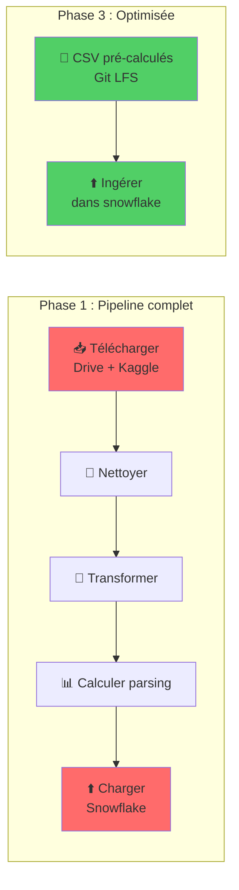

# Journal de bord - Pipeline de données NutriRAG

**Responsable** : Camelia Mazouz  
**Période** : Janvier 2026  
**Composant** : Pipeline de données et infrastructure Snowflake

---

## 📋 Vue d'ensemble

Ce journal documente la conception et la mise en œuvre complète du pipeline de données pour le projet NutriRAG, incluant l'ingestion, le nettoyage, la transformation et le stockage de données de recettes dans Snowflake.

---

## 🎯 Responsabilités et organisation d'équipe

### Ma contribution
J'ai été responsable de l'ensemble du **pipeline de données** (dossier `database/`), couvrant :
- La sélection et le sampling des données brutes
- Le nettoyage et la validation des recettes
- L'automatisation de la création de la base de données
- L'ingestion dans Snowflake
- L'optimisation des performances du pipeline

### Collaboration interne et externe
- **Équipe RAG** : Transformation des colonnes pour répondre à leurs besoins spécifiques
  - Stringification des listes (`tags`, `steps`, `ingredients`)
  - Transformation de la colonne `nutrition` en format texte
  - Ajout d'une colonne `filters` pour faciliter la recherche par régimes alimentaires

---

## 📊 Phase 0 : Exploration et échantillonnage initial

### Contexte et contraintes
**Problématique** : Le dataset complet contient ~230 000 recettes, mais Snowflake impose des limites de taille pour l'upload de fichiers.

**Solution** : Sélection aléatoire progressive pour permettre aux autres équipes de commencer leur travail.

### Étapes réalisées

#### 1. Premier échantillon (10 000 recettes)
- **Objectif** : Fournir rapidement un dataset de travail aux autres équipes

#### 2. Nettoyage approfondi (échantillon 1 000 lignes)

Développement et validation des règles de nettoyage sur un petit échantillon :

**Critères de filtrage appliqués** :
```python
# Règles métier
- minutes > 5  # Temps de préparation minimum
- id IS NOT NULL
- submitted IS NOT NULL
- description IS NOT NULL
- name IS NOT NULL AND LENGTH(name) > 0

# Validation des listes
- ARRAY_SIZE(tags) >= 1
- ARRAY_SIZE(nutrition) = 7  # Format standardisé
- ARRAY_SIZE(steps) >= 1
- ARRAY_SIZE(ingredients) >= 1
- ARRAY_SIZE(filters) >= 1 # colonne ajoutée
```

**Implémentation** :
- Vérification de cohérence des champs : `n_steps` doit égaler `len(steps)`, `n_ingredients` doit égaler `len(ingredients)`
- Parsing sécurisé des données imbriquées (conversion des listes stockées en texte en vraies structures Python) et exclusion des lignes avec incohérences
- Vérification des valeurs négatives (ex: `minutes < 0`) et des champs obligatoires vides
- Réalisé dans le notebook de nettoyage (**clean_recipes.ipynb**)


#### 3. Fusion avec données externes (~200 000 recettes)
(Tache réalisée avec Aleksandra et Aurélien)

**Problème identifié** : Les données de base manquaient de précision sur les quantités d'ingrédients.

**Solution** : Fusion de trois sources de données
- Données de base (RAW_recipes.csv)
- Données Kaggle avec images et métadonnées (`behnamrahdari/foodcom-enhanced-recipes-with-images`)
- Données Kaggle avec quantités et search terms (`shuyangli94/foodcom-recipes-with-search-terms-and-tags`)

**Résultat** : ~200 000 recettes enrichies

#### 4. Filtrage par régimes alimentaires (~110 000 recettes)

**Objectif** : Créer une colonne `filters` pour permettre la recherche par critères diététiques.

**Tags ciblés** :
```
vegetarian, vegan, kosher, egg_free, dairy_free, salt_free, 
flour_less, grain_free, sugar_free, carb_free, low_carb, 
low_cholesterol, low_protein, low_calorie, low_saturated_fat, 
gluten_free, fat_free, no_shell_fish, diabetic, low_sodium, 
nut_free, low_fat, halal, amish, non_alcoholic
```

**Implémentation** : 
- Durant la phase 0, ajout rapide d'une colonne `filters` via un script Python qui parcourt les tags et génère les filtres dans la table RAW.
- Dans la version automatisée, création d'une UDF Snowflake Python pour extraire ces filtres plus rapidement côté serveur.

**Résultat** : Conservation de ~110 000 recettes avec au moins un filtre diététique (représentatif de la base originale)

#### 5. Échantillon final (50 000 recettes)

- Nettoyage final avec vérification des noms (`LENGTH(name) > 0`)
- Sélection de 50 000 recettes pour équilibrer volume et qualité

**Notebooks utilisés** :
- **clean_recipes.ipynb** : Nettoyage et validation
- **Ingestion_des_doonees.ipynb** : Ajout de la colonne filters et ingestion

---

## ⚙️ Phase 1 : Automatisation de la création de la base de données

### Objectif
Automatiser complètement le setup de l'infrastructure Snowflake pour permettre un déploiement reproductible.

### Architecture développée

```
database/scripts/
├── python/
│   ├── main.py                   # Point d'entrée du pipeline
│   ├── PipelineOrchestrator.py   # Orchestration des phases
│   ├── SnowflakeConnector.py     # (-> SnowflakeUtils) Connexion Snowflake
│   ├── DataLoader.py             # (deleted) Téléchargement Drive/Kaggle
│   ├── DataTransformer.py        # (not used) Nettoyage et validation
│   ├── RecipeCleaner.py          # (deleted) Nettoyage et validation
│   ├── generate_schema.py        # Generation du schema de la DB en se basant sur les variables d'env
│   ├── SnowFlakeIngestor.py      # (-> CleanData) Ingestion dans Snowflake
│   └── config.py                 # Configuration centralisée
└── sql/
    ├── schema_db_template.sql     # Template du schéma
    ├── schema_db_generated.sql    # Schéma généré
    ├── nutri_score.sql    # Schéma généré
    ├── ingest_clean_recipes.sql   # Ingestion et nettoyage
    └── extract_filters_udf.sql    (deleted)# UDF extraction filtres
  (Les mentions entre parenthèses indiquent l'état final des fichiers : renommage vers un nouvel utilitaire, suppression, ou non utilisation dans la version stabilisée.)
```

### Scripts développés

#### 1. **main.py**
Point d'entrée avec options modulaires :
```bash
# Pipeline complet
python main.py

# Phases individuelles
python main.py --setup-only      # Création du schéma
python main.py --load-only       # Téléchargement des données
python main.py --clean-only      # Nettoyage
python main.py --ingest-only     # Ingestion des données dans Snowflake

# Tests avec données limitées
python main.py --nrows 1000
```

#### 2. **PipelineOrchestrator.py**
Orchestration des 4 étapes du pipeline :
- **Etape 0** : Setup du schéma Snowflake
- **Etape 1** : Chargement des données (Drive + Kaggle)
- **Etape 2** : Nettoyage et transformation
- **Etape 3** : Ingestion dans Snowflake

#### 3. **SnowflakeConnector.py**
Gestion sécurisée de la connexion :
- Authentification par clé privée RSA
- Méthode `safe_execute()` pour l'exécution sécurisée de SQL

#### 4. **DataLoader.py**
Téléchargement automatique des données :
- Google Drive avec `gdown`
- Kaggle avec `kagglehub`
- Cache local pour éviter les téléchargements répétés

#### 5. Génération de schéma dynamique
Template SQL avec variables d'environnement :
```sql
-- schema_db_template.sql
CREATE DATABASE IF NOT EXISTS ${DATABASE_NAME};
CREATE WAREHOUSE IF NOT EXISTS ${WAREHOUSE_NAME};
```

Génération automatique via **generate_schema.py** à partir du `.env`

---

## 🔄 Phase 2 : Stratégies d'ingestion des données

### Approche 1 : Génération de requêtes INSERT (❌ Abandonnée)

**Implémentation initiale** : **SqlInsertGenerator.py**
- Génération d'un fichier SQL avec des milliers d'INSERT
- Exécution séquentielle dans Snowflake

**Problème** : 
- Temps d'exécution > 3 heures
- Gestion complexe des caractères spéciaux et échappement
- Forte consommation mémoire

**Raison de l'abandon** : Non-scalable pour notre volume de données

### Approche 2 : Méthode native Snowflake (✅ Solution retenue)

**Avantages** :
- Traitement côté serveur (beaucoup plus rapide)
- Exploitation des capacités de calcul distribuées de Snowflake
- Pas de transfert réseau massif
- Temps d'exécution beaucoup plus rapide

**SQL d'ingestion** : tout le traitement est exécuté côté serveur Snowflake. On charge les données une seule fois, puis on applique UDFs et requêtes SQL directement dans Snowflake pour éviter les transferts réseau et accélérer l'exécution.

---

## 💾 Évolution de la stratégie de stockage des données

### Évolution 1 : Téléchargement à la demande
**Méthode initiale** : 
- Téléchargement depuis Kaggle/Drive à chaque exécution
- Stockage temporaire local

**Problèmes** :
- Temps de setup ~15-20 minutes
- Dépendance à la connexion internet


### Évolution 2 : Git LFS (Large File Storage)
**Implémentation actuelle** :
- Stockage des CSV dans le dossier `dataset/`
- Versionnement avec Git LFS
- Fichiers trackés :
  ```
  dataset/RAW_recipes.csv
  dataset/RAW_interactions.csv
  dataset/recipes_enhanced_v2.csv
  dataset/recipes_w_search_terms.csv
  dataset/cleaned_ingredients.csv
  ```

**Avantages** :
- **Praticité** : Clone du repo = données incluses
- **Reproductibilité** : Même version pour toute l'équipe
- **Rapidité** : Pas de téléchargement à chaque setup
- **Versionnement** : Historique des modifications de données

---

## 🚀 Phase 3 : Optimisation et pré-calcul

### Stratégie d'optimisation

**Constat** : Le pipeline complet (téléchargement → nettoyage → transformation → ingestion) prenait > 1 heure.

**Solution** : Pré-calcul et stockage des données finales

### Données pré-calculées stockées dans Git LFS

1. **Sample final (50K recettes)** : Données nettoyées et validées
2. **Clusters d'ingrédients** : **`ingredients_with_clusters.csv`**
3. **Matching ingrédients** : Correspondance avec bases nutritionnelles
4. **Parsing des quantités** : Extraction et normalisation des unités

### Processus de chargement direct

#### Comparaison entre phase 1 et 3



**Résultat** : 
- Temps de setup réduit de ~60 minutes à ~5 minutes
- Pipeline simplifié et plus fiable
- Facilite l'onboarding de nouveaux développeurs

---

## ⚠️ Difficultés rencontrées et résolutions

### Incident critique : Suppression accidentelle du warehouse

**Contexte** : Pendant une phase de tests

**Incident** : 
- Suppression complète du warehouse Snowflake
- **Perte de** :
  - Base de données complète
  - Toutes les tables (RAW, CLEANED, DEV_SAMPLE)
  - Procédures stockées
  - UDFs (User Defined Functions)
  - Agents Snowflake
  - Notebooks de test

**Impact** : 
- Arrêt temporaire du développement (10min de stress)
- Risque de perte de plusieurs jours de travail

**Résolution** : 
- Découverte de la fonctionnalité **Time Travel** de Snowflake
- Utilisation de la "corbeille" Snowflake (UNDROP)
- **Récupération intégrale** du warehouse :
  ```sql
  UNDROP DATABASE NUTRIRAG_PROJECT;
  UNDROP WAREHOUSE NUTRIRAG_PROJECT;
  ```

**Leçons apprises** :
1. ✅ Toujours travailler avec une base de test séparée
2. ✅ Documenter les commandes de sauvegarde/restauration
3. ✅ Importance des features de récupération de Snowflake

### Autres difficultés techniques

#### 1. Gestion des données imbriquées
**Problème** : Colonnes avec listes Python (`['item1', 'item2']`) stockées en string

**Solution** :
- Parsing avec `ast.literal_eval` dans **DataTransformer.py**
- Conversion en ARRAY natif Snowflake
- Validation du format avant insertion

#### 2. Performance de l'ingestion
**Problème** : INSERT séquentiel trop lent

**Solution** : Passage à l'ingestion côté serveur SQL (voir Phase 2)

#### 3. Qualité des données
**Problème** : Nombreuses incohérences (n_steps ≠ len(steps))

**Solution** :
- Validation stricte dans **DataTransformer.check_consistency()**
- Logs détaillés des erreurs
- Exclusion des lignes invalides plutôt que correction automatique

---

## 📈 Métriques et résultats

### Volume de données traité
- **Dataset initial** : 230 000 recettes
- **Après fusion** : 200 000 recettes enrichies
- **Après filtrage diététique** : 110 000 recettes
- **Échantillon final** : 50 000 recettes de haute qualité

### Performance du pipeline
| Phase | Temps (version initiale) | Temps (version optimisée) |
|-------|--------------------------|---------------------------|
| Setup schéma | 1 min | 1 min |
| Téléchargement | 15 min | 30 sec (Git LFS) |
| Ingestion | 180 min (INSERT) | 8 min (SQL natif) |
| **TOTAL** | **~196 min** | **~9 min** |

**Gain de performance** : Réduction de 93% du temps d'exécution

### Qualité des données
- **Taux de validation** : ~90% des recettes passent les critères de qualité
- **Complétude** : 100% des recettes finales ont tous les champs obligatoires
- **Filtres diététiques** : 100% des recettes finales ont au moins un filtre

---

## 🛠️ Technologies et outils utilisés

### Infrastructure
- **Snowflake** : Data warehouse cloud
  - Snowpark pour le traitement Python
  - UDFs Python pour la logique métier
  - Time Travel pour la récupération de données

### Langages
- **Python 3.9+** : Scripts d'orchestration et transformation
- **SQL** : Requêtes Snowflake et définition de schéma

### Outils de développement
- **Git LFS** : Versionnement des gros fichiers
- **Jupyter Notebooks** : Exploration et prototypage
- **VS Code** : Développement principal

---

## 📚 Documentation produite

### Fichiers README
- **database/README.md** : Documentation complète du pipeline
- Scripts SQL commentés avec docstrings

### Structure de code
- Architecture modulaire avec séparation des responsabilités
- Classes dédiées par fonctionnalité (Loader, Transformer, Connector, Ingestor)
- Configuration centralisée dans **config.py**

### Exemples d'utilisation
Documentation des commandes dans le README principal avec cas d'usage spécifiques

---


## 🤝 Collaboration et communication

### Points de synchronisation
- Réunions/echanges de messages avec l'équipe 1 pour faire des points d'avancement

### Méthodes de travail GIT
- Chaque fonctionnalité est développée sur une branche dédiée. Une fois terminée, une Pull Request est créée et assignée à un autre membre de l'équipe pour révision et validation avant fusion.

---

## ✅ Conclusion

Le développement du pipeline de données pour NutriRAG a nécessité plusieurs itérations pour atteindre un équilibre entre :
- **Performance** : Réduction drastique des temps d'exécution
- **Qualité** : Validation stricte et nettoyage approfondi
- **Maintenabilité** : Code modulaire et bien documenté
- **Reproductibilité** : Git LFS et automatisation complète

Les choix techniques (SQL natif Snowflake, Git LFS, pré-calcul) ont permis de créer un pipeline robuste et scalable, prêt pour la production.

