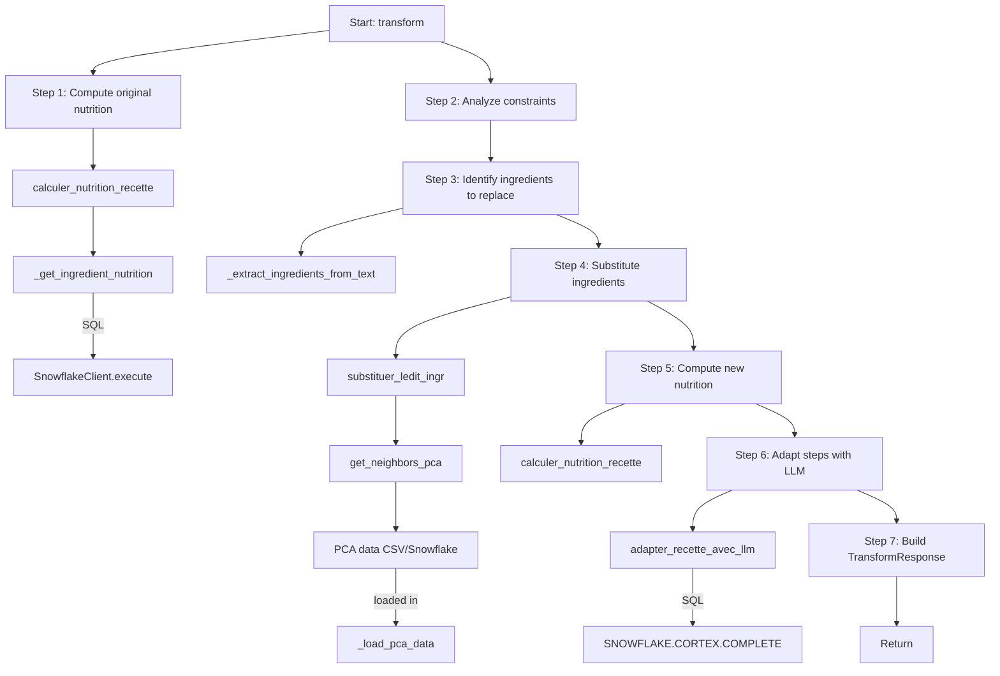

```mermaid
flowchart TD
    A[Start: transform] --> B[Step 1: Compute original nutrition]
    B --> B1[calculer_nutrition_recette]
    B1 --> B2[_get_ingredient_nutrition]
    B2 -->|SQL| B3[SnowflakeClient.execute]

    A --> C[Step 2: Analyze constraints]
    C --> D[Step 3: Identify ingredients to replace]
    D --> D1[_extract_ingredients_from_text]

    D --> E[Step 4: Substitute ingredients]
    E --> E1[substituer_ledit_ingr]
    E1 --> E2[get_neighbors_pca]
    E2 --> E3[PCA data CSV/Snowflake]
    E3 -->|loaded in| E4[_load_pca_data]

    E --> F[Step 5: Compute new nutrition]
    F --> F1[calculer_nutrition_recette]

    F --> G[Step 6: Adapt steps with LLM]
    G --> G1[adapter_recette_avec_llm]
    G1 -->|SQL| G2[SNOWFLAKE.CORTEX.COMPLETE]

    G --> H[Step 7: Build TransformResponse]
    H --> I[Return]
```
